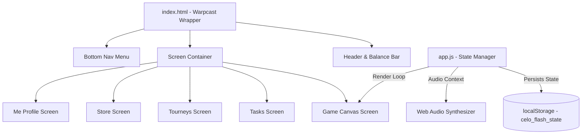

# Celo Flash ⚡

## Speed into the Celo economy.

**Celo Flash** is a fast, mobile-first arcade game built for the **Celo ecosystem**. It transforms Web3 onboarding, ecosystem discovery, rewards, tournaments, and user engagement into a simple, exciting, and replayable game experience.

Instead of introducing users to Celo through complex wallet flows or long tutorials, Celo Flash brings them in through play. Users collect CELO coins, avoid bombs, activate power-ups, complete ecosystem tasks, join USDm-powered tournaments, unlock partner-themed skins, and compete on leaderboards.

Celo Flash is more than an arcade game.

It is a **gamified onboarding and engagement layer for the Celo economy**.

---

## 🎮 Overview

The game combines:
* Fast arcade gameplay
* Celo-themed collectibles
* Virtual CELO rewards
* USDm-based tournaments
* Daily ecosystem tasks
* Partner-branded skins
* Leaderboards
* Wager mechanics
* Browser-based audio
* Local state persistence

The goal is simple:
> Make Celo discovery feel like play, not a lecture.

---

## Why Celo Flash?

Celo is built around mobile-first access, real-world payments, stable-value assets, and inclusive financial tools.

Celo Flash supports that vision by creating a fun entry point for new users. Players do not need to understand wallets, stablecoins, swaps, or on-chain rewards before participating. They can start with a simple arcade loop:
1. Play a quick round
2. Collect CELO
3. Complete tasks
4. Unlock upgrades
5. Join tournaments
6. Discover ecosystem products
7. Return daily to improve their score

This turns casual attention into active ecosystem participation.

---

## ⚡ Core Features

* **Mobile-first arcade gameplay**
* **CELO-themed rewards**
* **USDm-powered tournament experience**
* **Daily and featured ecosystem tasks**
* **Partner-branded collectibles and skins**
* **Power-ups and score boosters**
* **Leaderboard and ranking progression**
* **Virtual wager mode**
* **Persistent local player progress**

---

## 📱 Interface Structure

Celo Flash uses a mobile-first layout inspired by mini-app, Mini-Pay, and social frame experiences.

On desktop, the game appears inside a polished mobile-style container.
On mobile, it expands naturally into a full-screen app-like experience.

The interface is designed to be:
* Simple
* Fast
* Touch-friendly
* Social-ready
* Easy to understand
* Easy to replay

### 🎮 Game Tab
The main gameplay screen where users play arcade rounds and earn points.
Features include:
* Arcade canvas board
* Easy mode
* Hard mode
* CELO wager mode
* Score tracking
* Power-up slots
* Game-over summary
* Responsive player movement

### 📋 Tasks Tab
The task hub allows users to earn bonus rewards by completing daily and ecosystem-related actions.
Task states are saved locally so users can track progress across sessions.

### 🏆 Tournaments Tab
The tournament section introduces competitive gameplay. Users can:
* Join tournaments
* Pay USDm entry fees
* Compete for Celo/USDm prize pools
* Track leaderboard rankings
* Create custom challenges
* Participate in time-limited events

This creates a repeatable engagement loop around competition, rewards, and social sharing.

### 🛍️ Store Tab
The store allows users to unlock upgrades, boosts, and branded ecosystem items:
* Daily renewals
* Score multipliers
* Power-up boosts
* Valora-themed spawners (drops hearts 💚)
* Mento-themed spawners (drops clovers 🍀)
* Future partner skins

---

## 🤝 Partner Integrations

Celo Flash can serve as a playful distribution channel for Celo ecosystem partners. Partner integrations can appear as:
* Branded collectibles
* Sponsored tasks
* Partner tournaments
* Campaign leaderboards
* Custom skins
* In-game quests
* Product discovery missions

Instead of sending users to static links, partners can become part of the gameplay experience.

### 💚 Valora Skin
A custom spawner skin that drops Valora-themed heart collectibles.

### 🍀 Mento Skin
A custom spawner skin that drops Mento-themed clover collectibles.

---

## 📈 Monetization & Growth

Celo Flash sits at the intersection of gaming, consumer crypto, stablecoin adoption, ecosystem marketing, and social quests. Monetization channels include:
* Tournament entry fees (USDm)
* Sponsored ecosystem tasks
* Partner-branded skins
* Premium power-ups
* Featured campaigns
* Seasonal competitions
* Referral campaigns
* Token-gated challenges
* Partner activation packages

---

## 🛠️ Developer Technical Details

### Game Architecture

Celo Flash is built as a lightweight, zero-dependency Single Page Application (SPA).



### Technical Stack
* **Core**: Pure HTML5 and vanilla JavaScript (ES6+).
* **Styling**: CSS Custom Properties (`index.css`) defining the dark green-gold color scheme, frosted glassmorphism overlays, and keyframe-based glow animations:
  ```css
  :root {
    --primary-purple: #fbcc27; /* Celo Gold */
    --accent-blue: #35d07f;    /* Celo Green */
    --bg-dark: #06100c;        /* Emerald Black */
    --game-bg: #143d2f;        /* Deep Canvas Forest */
  }
  ```
* **Web Audio API Synthesizer**: Generates retro synth sound waves for clicks, collections, power-ups, explosions, victories, and game-overs without loading external audio assets.
* **State Persistence**: Uses `localStorage` under the key `celo_flash_state` to store wagers, points, high scores, task verifications, and custom skins.

---

## 🚀 Local Deployment

To run Celo Flash locally, launch any static file server from the root of the project directory.

### Using Python:
```bash
python3 -m http.server 8080
```

### Using Node.js (http-server):
```bash
npx http-server -p 8080
```

Open **`http://localhost:8080`** in your browser to play!
